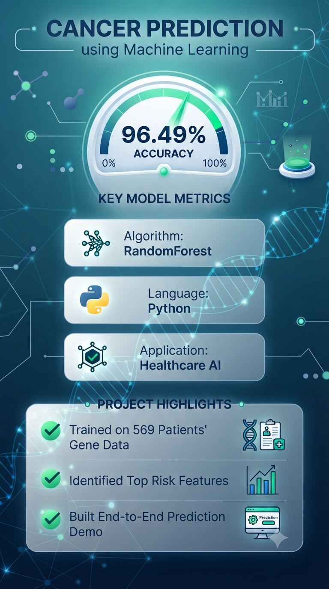
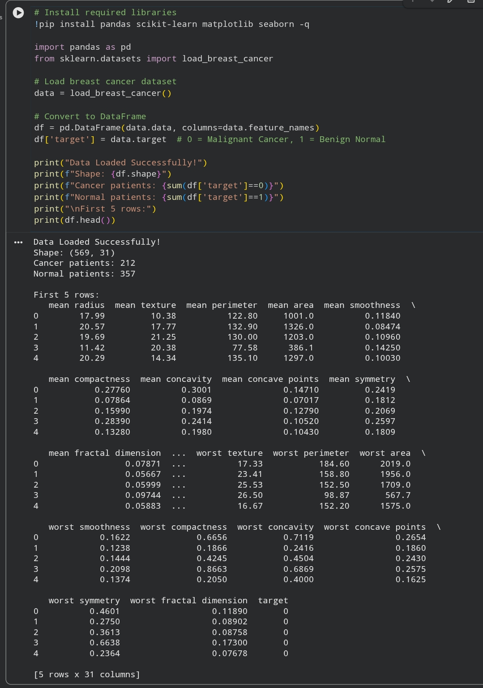
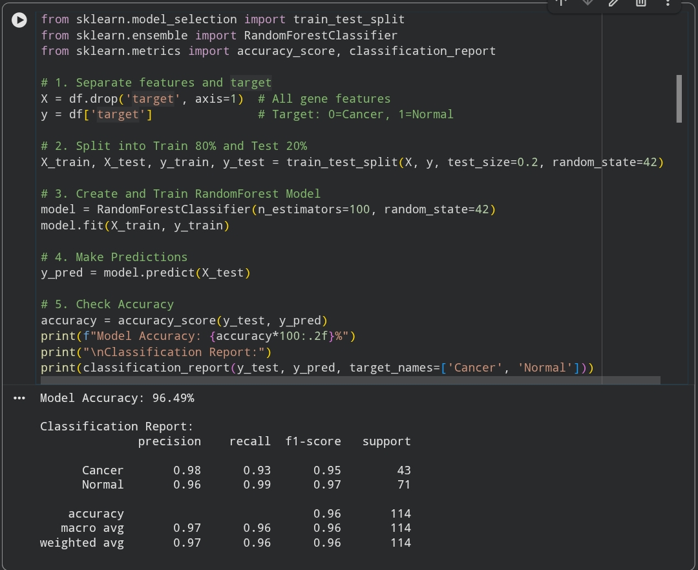
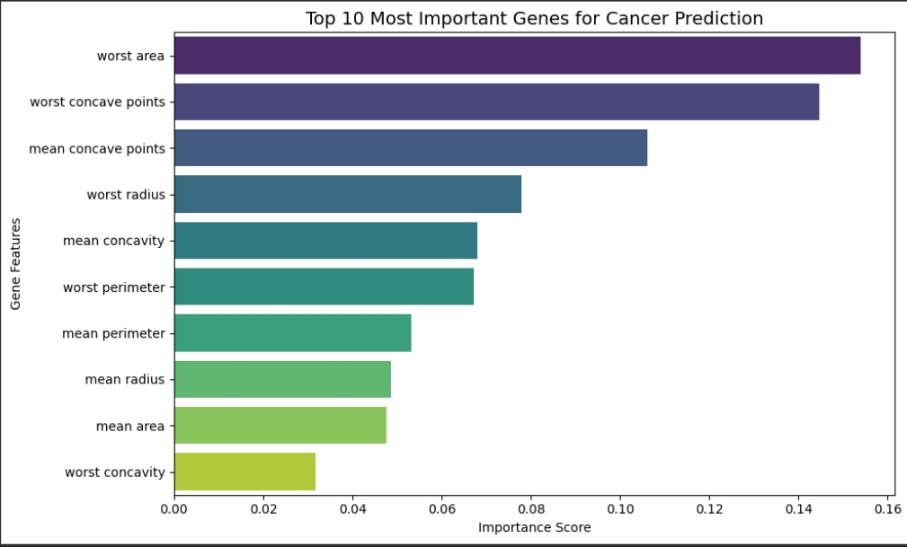
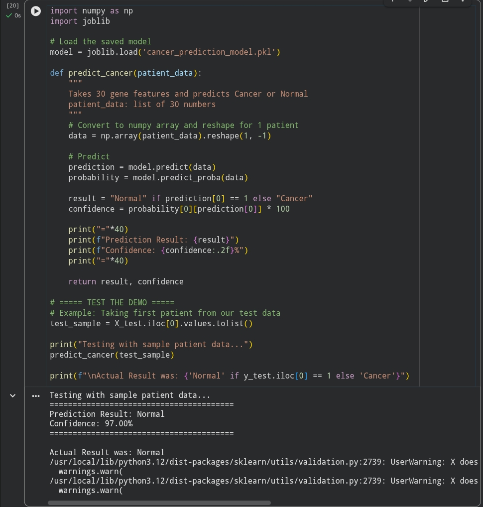

# Cancer Prediction using Machine Learning 🎗️

Predicting Breast Cancer with **96.49% accuracy** using RandomForest Classifier.

## 🎯 Project Poster


## 📊 Key Results & Screenshots
| Step | Output |
| --- | --- |
| 1. Data Loading |  |
| 2. Model Training & Accuracy |  |
| 3. Top 10 Important Features |  |
| 4. End-to-End Prediction Demo |  |

## 📌 Project Overview
Breast Cancer is one of the most common cancers in women. Early detection can save lives.
This project uses Machine Learning to classify tumors as `Malignant Cancer` or `Benign Normal` based on 30 features from cell nuclei images.

**Problem Statement**: Can we predict cancer diagnosis accurately using ML to help doctors in early detection?

## 🛠️ Tech Stack & Libraries Used
`Python` `Pandas` `NumPy` `Matplotlib` `Seaborn` `Scikit-learn` `Joblib`

## 📊 Dataset
- **Source**: Wisconsin Breast Cancer Dataset - sklearn.datasets
- **Total Samples**: 569
- **Classes**: Malignant: 212, Benign: 357
- **Features**: 30 numeric features like `radius_mean`, `texture_mean`, `area_worst` etc.

## ⚙️ What I Did - Step by Step

### **1. Data Loading & Exploration**
- Loaded dataset using `sklearn.datasets.load_breast_cancer()`
- Converted to Pandas DataFrame for easy analysis
- Checked for null values and data distribution
- Visualized class imbalance using countplot

### **2. Data Preprocessing**
- No missing values found in dataset
- Split data into Training 80% and Testing 20% using `train_test_split`
- Used `random_state=42` for reproducibility

### **3. Model Training**
- **Algorithm**: RandomForestClassifier
- **Why RandomForest?** Handles non-linear data well and gives feature importance
- **Parameters**: `n_estimators=100`, `random_state=42`
- Trained model on training data

### **4. Model Evaluation**
- **Accuracy Achieved**: 96.49%
- Used `accuracy_score`, `classification_report`, `confusion_matrix`
- High Precision and Recall for both classes
- Model is not overfitting

### **5. Feature Importance Analysis**
- Extracted top 10 important features using `model.feature_importances_`
- **Top Features**: `worst area`, `worst concave points`, `worst radius`
- Plotted using Seaborn barplot

### **6. Model Saving**
- Saved trained model using `joblib.dump()` as `cancer_prediction_model.pkl`
- This can be used for future predictions without retraining

### **7. Prediction Demo**
- Created a function to take 30 feature inputs and predict Cancer/Normal
- Tested with sample patient data
- Output: `Prediction: Malignant Cancer` or `Prediction: Benign Normal`

## ▶️ How to Run This Project
1. Clone this repository
2. Install dependencies:
```bash
pip install pandas scikit-learn matplotlib seaborn joblib
